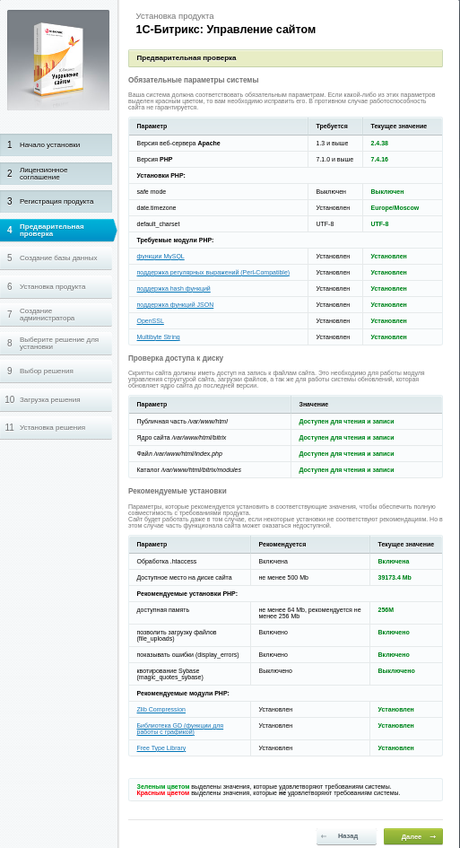

<h3> Окружение для запуска битрикс через docker. </h3>
docker-compose build  && docker-compose up -d

**APACHE**

IP APACHE
 `docker inspect apache | grep "IPAddress"`

Вход в контейнер
`docker exec -it apache bash`

<a  href="http://127.0.0.1/bitrix_server_test.php">test bitrix server</a>  
<a  href="http://127.0.0.1/bitrixsetup.php">setup bitrix </a>  

**MYSQL**

- ip mysql  `docker inspect mysql | grep "IPAddress"`
- Вход в контейнер `docker inspect mysql | grep "IPAddress"`

- MYSQL_USER=bitrix
- MYSQL_PASSWORD=password
- MYSQL_DATABASE=bitrix
- MYSQL_ROOT_USER=root
- MYSQL_ROOT_PASSWORD=root

**mail**

Исходящие письма будут попадать в папку <a  href="./mail">mail</a>  

